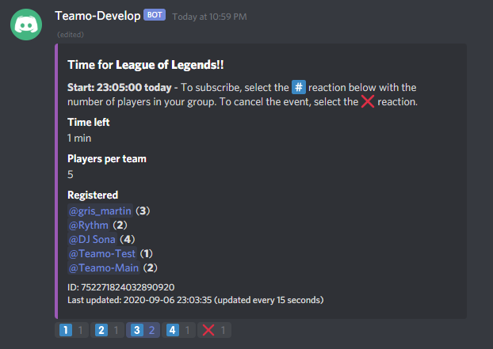
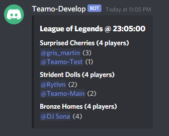

# Teamo
A Discord bot for creating teams and finding people to play with :)

## Using Teamo
Teamo is a Discord bot that can be used to create teams of a certain size at a certain time. The main Teamo command looks like this:

```
@Teamo create <number of players per team> <time> <game>
```
where
- **\<number of players per team\>** is the number of players per team for the particular game.
- **\<time\>** is the time to start the game, of the form hh:mm.
- **\<game\>** is the name of the game.

For example:
```
@Teamo create 5 23:05 League of Legends
```

will create a Teamo for 23:05 with 5 players in each team. The game name, League of Legends, is only used to show which game will be played.

### The "waiting" message
When a `create` command has been sent, a message looking something like this will be displayed (given that the command was successful)



To register for playing, press a number reaction at the bottom, with the number of players who will be joining from your group. E.g. if you and a friend wants to register to be in the same team, you can press the 2️⃣ reaction, and your friend doesn't have to press anything. If you find another friend and want to change the number of players in your group, just press another reaction and the registration will update automatically.

In this example I got some help from my bot friends to demonstrate :)

If you want to cancel the registration, press the ❌ reaction. The message will be deleted after 15 seconds.


### The "finished" message
Once the time has run out, Teamo will remove the old message and post a new message with everyone divided into teams. The teams will be created to be as few as possible and as equal as possible and will be given unique names. In this case Teamo decided that 3 teams with 4 in each was the best alternative. DJ Sona seems to be on her own, but she has 3 friends from before so she will be okay :)

Teamo will mention everyone so no one should miss the event.



Good luck and have fun in the game!

### Commands

- **create \<number of players per team\> \<time (hh:mm)\> \<game\>** - Create a new Teamo!
- **settings** - See and change server-wide settings. The sub-options `set <key> <value>`, `get <key>` and `showall` exists.
- **welcome** - Post a nicely formatted message which can be pinned to a channel to show everyone how to use Teamo.
<!-- - **Edit game** - `@Teamo edit game <game>`
- **Edit max players** - `@Teamo edit maxPlayers|players <maxPlayersPerTeam>`
- **Edit date or time** - `@Teamo edit date|time <date/time>`
- **Cancel** - `@Teamo delete|remove|cancel <id>` -->

### Adding Teamo to your server

I have a Teamo instance hosted privately which can be added to a server using this link: https://discord.com/api/oauth2/authorize?client_id=589788908032622623&permissions=76864&scope=bot

The following permissions are needed:

- **View Channels** - Needed to read and respond to messages.
- **Send Messages** - Needed to send messages.
- **Manage Messages** - Needed to update the Teamo message as people register, and to delete old messages (if configured to do that).
- **Read Message History** - Needed to allow Teamo to find old Teamo messages if the bot script is restarted for some reason.
- **Add Reactions** - Needed to add the registration and cancel reactions.

## Developing
### Environment variables
Teamo can be configured using a few environment variables:

- `TEAMO_BOT_TOKEN` - The bot token acquired from [Discord Developer Portal](https://discord.com/developers/applications) (required).
- `TEAMO_UPDATE_INTERVAL` - The update interval of Teamo messages in seconds. Default: 15.
- `TEAMO_CHECK_INTERVAL` - The interval in seconds for which to check whether a message is done (should trigger the "finished" message). Default: 5

### Quick-start guide
To work with Teamo, I recommend doing the following steps in a terminal:

- (Install Python >3.8 if not already installed)
- Set the `TEAMO_BOT_TOKEN` environment variable.
- Clone the teamo repository
- Create a virtual environment
- Install Teamo in edit mode (otherwise the scripts will not have the paths setup correctly)

These steps can be done using these console commands (given that `python` is the path to your Python 3.8 installation):
```
python -m pip install virtualenv
python -m virtualenv venv
python -m pip install --update pip setuptools wheel
pip install -e .
```

Teamo can then be run using `python -m teamo` or `python teamo/app.py`

### Testing
Teamo uses [pytest](https://docs.pytest.org/en/stable/) for unittests. To run the tests, do these steps:

- Install pytest
- Run pytest

```
python -m pip install pytest pytest-asyncio
pytest
```

### Teamo with Visual Studio Code
The [Python plugin](https://marketplace.visualstudio.com/items?itemName=ms-python.python) for Visual Studio Code allows debugging scripts and tests.

I recommend setting the `TEAMO_BOT_TOKEN` environment variable in a terminal and starting Visual Studio Code from the same terminal.

#### Debugging Teamo
To debug scripts (such as the main script `teamo/app.py`) the following `launch.json` configuration can be used:

```json
{
    "configurations": [
        {
            "name": "Python: Teamo",
            "type": "python",
            "request": "launch",
            "program": "teamo/__main__.py",
            "console": "integratedTerminal"
        }
    ]
}
```

#### Debugging tests
To debug tests, you first have to configure the test runner by running `Python: Configure Tests` from the Command Palette (`Ctrl + Shift + P`). This will add an icon to the left (with a conical flask shape) where tests can be started and debugged.


### Contributing

Issues and pull requests are welcome :) To do a pull request, create a fork of this repository, do the changes, and create the pull request. See [this guide](https://docs.github.com/en/github/collaborating-with-issues-and-pull-requests/creating-a-pull-request-from-a-fork) for more info.

One good way to help out is to expand the nouns and adjectives in the `teamo/resources/nouns.list` and `teamo/resources/adjectives.list` files. They will be used when creating the teams!